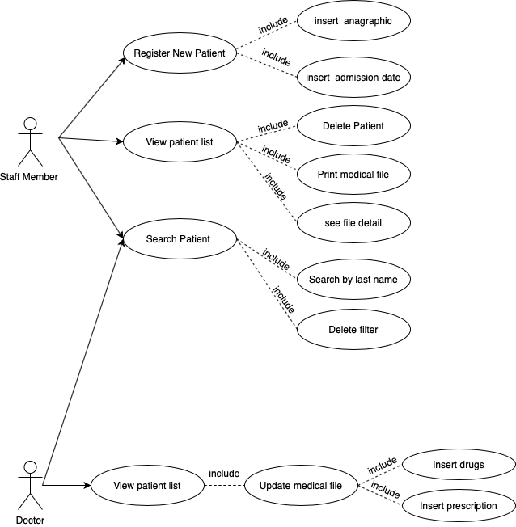
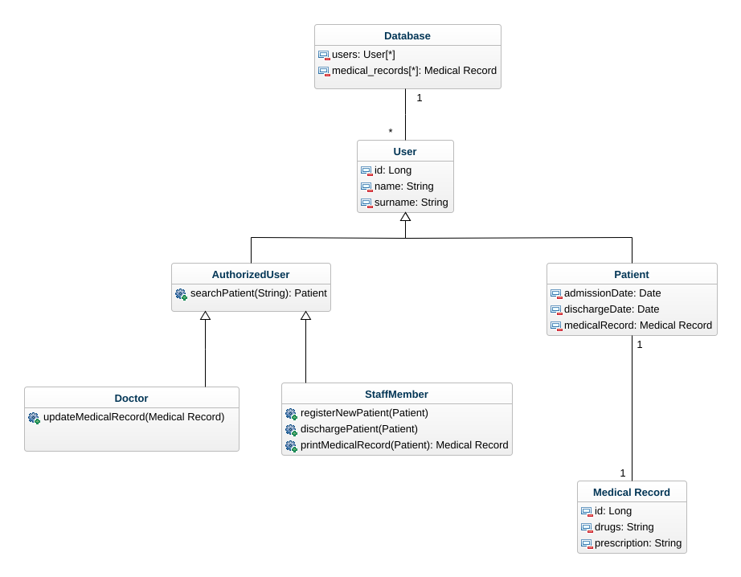
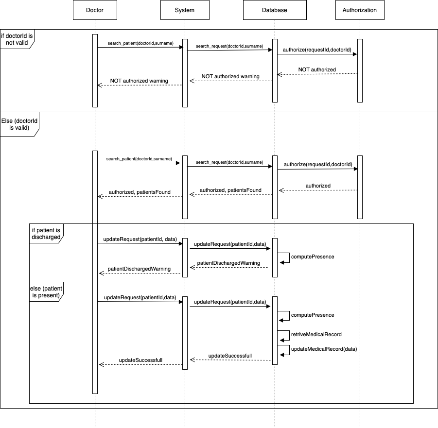
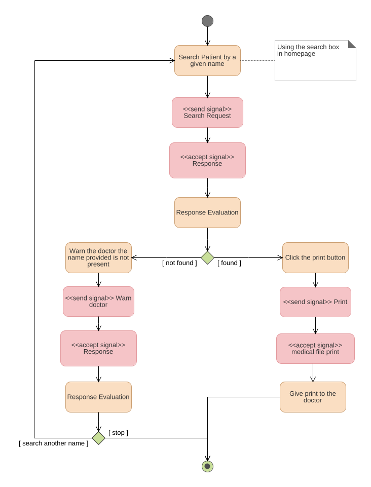
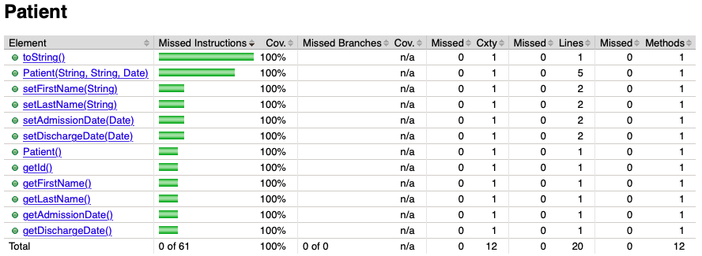
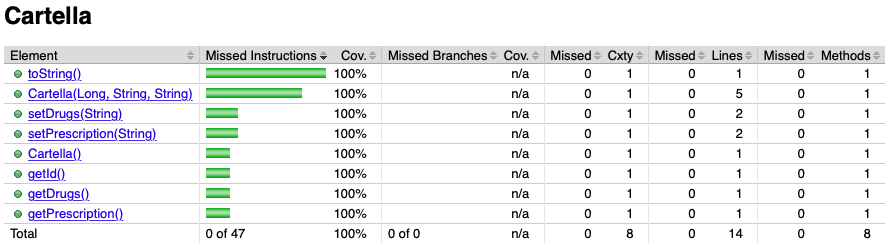

# Sistema per la gestione di pazienti con malattie mentali

## Introduzione

Il componente di sistema proposto si occupa della gestione di pazienti con malattie mentali e delle rispettive cartelle cliniche. La tipologia di utenza che interagisce con il sistema è composta da medici e personale dello staff ospedaliero.

Come pattern architetturale è stato utilizzato *Model View Controller* per poter separare la rappresentazione dei dati, scritta in *HTML*, dalla logica, scritta in *Java*. A questo proposito è stato infatti utilizzato il framwork Java *Spring*.

Il sistema di compone di una pagina principale che suddivide i pazienti in due tabelle:
1. *Pazienti presenti*: lista di tutti i pazienti attualmente ricoverati in struttura. 
2. *Pazienti dimessi*: lista di tutti i pazienti che sono stati dimessi, quindi con la data di dimissione impostata antecedentemente a quella odierna.

In homepage, per ogni paziente, sono disponibili alcune funzionalità. 

- *Mostra*: per visionare la cartella clinica di un paziente. Dalla medesima pagina è anche possibile:
  -  modificare il paziente e la rispettiva cartella clinica
  - cancellare il paziente e la rispettiva cartella clinica
  - tornare alla homepage.
- *Modifica*: per modificare un paziente e la sua cartella clinica 
- *Dimetti*: per dimettere un paziente. Questa operazione imposta la data di dimissione del paziente interessato a quella odierna.  Verrà poi conseguentemente spostato nella lista dei pazienti dimessi. 
- *Cancella*: Per cancellare un paziente.
- *Stampa scheda*: Genera la cartella clinica di un paziente in formato leggibile e di facile fruizione.

Infine, a fondo pagina, sono disponibili due ulteriori funzionalità:

- *Registra un un paziente*: permette di registrare un nuovo paziente in struttura. Questa operazione fa si che venga creata anche una cartella clinica vuota (con il medesimo id) che dovrà essere poi popolata o modificata da un utente autorizzato.
- *Cerca*: attraverso una *search box* è possibile specificare il cognome di un paziente da utilizzare come filtro di ricerca. Cliccando nuovamente sul bottone *cerca*, lasciando *quindi* vuoto il campo di testo, vengono proposti tutti i pazienti presenti a sistema. Tale operazione di fatto annulla il filtro presente.

---

## Requisiti

Come segnalato in precedenza gli attori principali del sistema sono i dottori e il personale dello staff. Si possono dunque individuare requisiti specifici e comuni per ognuna di queste due entità.

#### Requisti membri dello staff

Un membro del personale deve poter:

- *Registrare un nuovo paziente*: tale azione avverrà tramite un’apposita anagrafica e dovrà avere come conseguenza la creazione di una cartella clinica vuota. Al momento della creazione, oltre a nome e cognome, verrà richiesta solamente la data di ricovero. La data di dimissione verrà dunque aggiornata con l’evolversi della situazione clinica del paziente interessato. 
- *Dimettere un paziente*: la dimissione di un paziente implica che la sua data di dimissione venga impostata a quella odierna. Contestualmente il suddetto verrà spostato dalla lista dei pazienti ricoverati a quella dei pazienti dimessi.
- *Stampare una cartella clinica*: ovvero mostrare in forma leggibile la cartella clinica di un paziente in modo tale che possa essere consegnata al medico curante.

#### Requisiti dottori

Un medico deve poter:

-  *Modificare e aggiornare la cartella clinica di un paziente* specificando i farmaci assunti e i dettagli della prescrizione.

#### Requisiti comuni
- *Ricercare un paziente*: attraverso un campo di testo deve essere possibile specificare un cognome che verrà utilizzato dal sistema come campo di ricerca fra le liste dei pazienti. Si noti che il sistema deve fornire risultati sia fra i pazienti presenti in struttura che fra quelli dimessi.

#### Vincoli

- Alla creazione di un paziente tutti i campi mostrati a video sono mandatori, ovvero: *nome*, cognome e *data di ricovero* vanno inseriti obbligatoriamente.
- Non è possibile cancellare o modificare né la cartella clinica né l’anagrafica di un paziente che è stato dimesso. 
- Deve essere possibile stampare la cartella clinica anche di un paziente che è stato dimesso.

---

## Scenari

**Scenario 1**: Registrazione di un paziente

- *Assunzione iniziale*: un nuovo paziente è arrivato in struttura. È compito di un membro del personale accedere alla piattaforma e registrare il paziente nel sistema informativo.

- *Uso normale*: il membro del personale deve compilare tre campi mandatori: 

  - *Nome*
  - *Cognome*
  - *Data di ricovero*

  Una volta completata l’operazione, dopo aver premuto il tasto di conferma, il sistema ricaricherà la lista aggiornata dei pazienti. 

- *Cosa può andare storto*: l'utente non specifica uno o più campi durante la creazione. In questo caso il sistema deve fornire un messaggio di errore per segnalarne l’obbligatorietà.
- *Stato del sistema al termine*: al termine della registrazione il sistema mostrerà la homepage e quindi la lista aggiornata dei pazienti

**Scenario 2**: Dimissione di un paziente

- *Assunzione iniziale*: un membro del personale deve poter dimettere un paziente in lista.
- *Uso normale*: in homepage, il membro del personale cliccherà sull’apposito link in corrispondenza della riga di tabella del paziente in oggetto. Una volta completata l’operazione il suddetto verrà spostato nella lista dei pazienti dimessi.
- *Cosa può andare storto*: la cartella clinica non deve essere cancellata a seguito della dimissione di un paziente per possibili accertamenti successivi. Per questo il sistema ne rende disponibile il link di presa visione anche a seguito della dimissione.
- *Stato del sistema al termine*: al termine della registrazione il sistema mostrerà la medesima pagina web e quindi la lista aggiornata dei pazienti.

**Scenario 3**: Aggiornamento di una cartella clinica

- *Assunzione iniziale*: un medico deve poter modificare una cartella clinica di un paziente.
- *Uso normale*: il medico può effettuare questa operazione in due modi:
  1. In homepage, cliccando sull'apposito link, si può prendere visione della cartella clinica di un paziente. Una volta aperta la pagina di dettaglio si può cliccare il link di modifica e inserire i nuovi campi.
  2. In homepage si può direttamente cliccare il link di modifica in corrispondenza della riga di tabella del paziente in oggetto e inserire i nuovi campi.

- *Cosa può andare storto*: non deve essere possibile modificare una cartella clinica di un paziente dimesso, il sistema gestisce questa necessità nelle due seguenti modalità:
  1. Nella tabella dei pazienti dimessi viene disabilitato il link di modifica.
  2. Dato che le cartelle cliniche sono visionabili anche se un paziente è stato dimesso, se un medico apre la pagina di dettaglio di una cartella clinica di un paziente dimesso non viene mostrato il link per accedere alla modifica. 

- *Stato del sistema al termine*: a seguito della pressione del tasto di conferma della modifica il sistema ricaricherà la lista dei pazienti.

**Scenario 4**: Stampa di una cartella clinica

- *Assunzione iniziale*: un membro del personale deve poter stampare una cartella clinica di un paziente per poterla consegnare ad un medico commissionante.
- *Uso normale*: in homepage, il membro del personale cliccherà sull’apposito bottone di stampa in corrispondenza della riga di tabella del paziente in oggetto. Una volta completata tale operazione verrà mostrata la cartella clinica del paziente in formato leggibile.
- *Cosa può andare storto*: deve essere possibile effettuare la stampa anche di un paziente che non è più presente in struttura. Per questo il sistema rende disponibile il bottone anche per i pazienti che risultano essere stati dimessi.
- *Stato del sistema al termine*: a seguito della pressione del tasto di stampa il membro del personale viene reindirizzato sulla pagina che mostra la cartella clinica del paziente in formato leggibile. 

**Scenario 5**: Ricerca di un paziente

- *Assunzione iniziale*: un membro del personale o un medico devono poter cercare un paziente per cognome.
- *Uso normale*: in homepage è disponibile una *search box* all’interno della quale è possibile specificare un cognome che verrà utilizzato dal sistema come criterio di ricerca. Dovranno quindi essere mostrate le occorrenze per ogni tipo di paziente (ricoverato e dimesso).
- *Cosa può andare storto*: il sistema non deve re-indirizzare su un’altra pagina per mostrare i risultati della ricerca. Questo rallenterebbe il processo, inoltre per velocizzare ulteriormente l'operazione di annullamento del filtro l’utente può cliccare nuovamente sul bottone di ricerca lasciando vuota la search box. 
- *Stato del sistema al termine*: a seguito della ricerca viene mostrata all'utente la medesima pagina composta però dalla lista dei pazienti filtrata in base al cognome specificato. 

---

## Design

#### Use case diagram

#### Class Diagram

#### Sequence Diagram

*Modifica di una cartella clinica da parte di un medico*

#### Activity Diagram

*Stampa di una cartella clinica da parte di un membro dello staff*

---

## Quality Assurance

Per misurare la copertura del codice è stato utilizzato JaCoCo.

#### Unit Testing

Le classi delle entità coinvolte nell'implementazione sono la *Patient.java* e la *Cartella.java*. Per entrambe è stato fatto uno *unit tesing* capillare (classi *CartellaTest.java* e *PatientTest.java*)  in modo tale da ottenere una copertura del codice del 100%.

 

#### Acceptance Test

É stato inoltre testato ogni *use case* (classe *ControllerAcceptanceTest.Java*) in modo tale da verificare che ogni requisito e ogni funzionalità fossero stati implementati coerentemente ai requisiti individuati.  

Per il testing è stato utilizzato il framwork *JWebUnit* che permette di testare applicazioni web con il supporto del linguaggio *XPath*.

Test effettuati:

- *testInitialView()*: verifica che la pagina iniziale sia quella corrretta
- *addNewPatientTest()*: verifica che la funzione di aggiunta di un nuovo paziente funzioni correttamente e che quindi comporti un aumento della lunghezza della lista pazienti.
- *deletePatientTest()*: verifica che la funzione di cancellazione di un paziente funzioni correttamente e che quindi comporti un decremento della lunghezza della lista pazienti.
- *testOperation()*: verifica che siano state inserite le operazioni richieste e che queste re-indirizzino alle opportune pagine web.
- *testDischarge()*: verifica il corretto funzionamento della funzione di dimissione di un paziente e quindi che comporti un decremento della lunghezza della lista dei pazienti ricoverati e un aumento della lunghezza della lista dei pazienti dimessi.
- *testUpdateRecord()*: verifica il corretto funzionamento della funzione di modifica.
- *testSearchPatient()*: verifica il corretto funzionamento della funzione di ricerca, ovvero che a seguito dell'utilizzo di tale funzione sia la lista dei pazienti ricoverati che quella dei pazienti dimessi mostrino solamente le occorenze di pazienti con il cognome indicato.  
- *testNonEditableAndDeletableDischargedPatient()*: verifica che i pazienti dimessi non possano essere ne cancellati ne modificati ma che possa essere consultata la loro cartella clinica. Verifica quindi che la pressione dei link per accedere a tali funzionalità non abbiano alcun effetto e che una volta giunti nella pagina di dettaglio della cartella clinica non siano presenti i link di modifica e cancellazione.

